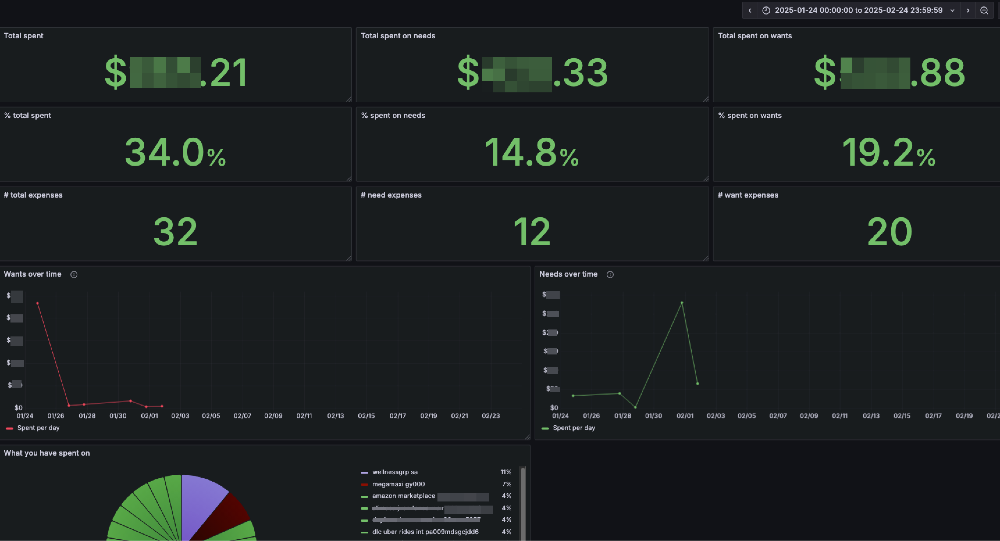

# 💸 50/30/20 Expenses Framework Visualizer



The 50/30/20 framework for managing for expenses basically means setting 20% of you income aside as savings,
30% for things that you want (_wants_) and 50% for things that you need (_needs_). You can read more about it
on the internet.

This project consists of an HTTP API to upload your account balance, classify expenses into needs and wants,
store them to a local Postgres database, and use that data to feed a Grafana dashboard so you can get
wonderful insights into your expenses 🤩.

## 📄 Expenses file format

The file format that the application uses is the one that can be obtained by downloading your account balance from
your bank website. It must be a TXT file.

I don't know if all banks follow the same format. I have tested using Banco Guayaquil. If you want support for
another format, feel free to open an issue about it :).

## 🔍 How are expenses classified?

Expenses classification is a very subjective topic, since what is considered a need for me may be a want for you.
Classification is performed by matching movement records against strings that fall into either category.

You are encouraged to modify the Haskell source code in the `lib` directory to make the classifier work for you.
Specifically, there are two lists, `wants` and `needs` that you can modify to suit your particular case.

## 💻 Run locally

First, make sure you have Docker 🐳 and docker compose 🐙 installed on your system.
Then, go through the following steps.

1. Clone this repository (or your fork)

```
git clone https://github.com/aloussase/S32EFV
cd S32EFV
```

2. Spin up the containers with docker compose

```
# If you have standalone docker compose
docker-compose up -d

# If you are using the compose plugin
docker compose up -d
```

3. Go to the Grafana dashboard @ http://localhost:3000
4. Enter the admin credentials (admin, admin)
5. Set your new password 🔑 (only important if you want to expose your dashboard publicly)
6. Open the Expenses Dashboard, you'll see there's no data
7. Hit the API to upload your expenses file and seed the database

```
# Using HTTPie, you can also use cURL or Postman
http -f POST :3001/api/expenses file@./expenses.txt
```

8. Refresh the dashboard
9. Some panels depend on a `montly_income` variable that is used to calculate percentages,
   to configure this variable go to your dashboard settings and set it to the correct
   value for you

## 🐘 Connecting to the database directly

If you need to connect to the database for some reason, run the following command

```
docker-compose exec db psql -U S32EFV
```

## 🫰 Contributing

Feel free to contribute in any of these ways:

- New panels with insightful data
- Improvements to API functionality
- Bug fixing
- Dashboard improvements
- Support for different file formats
- etc

## 👮 License
MIT
